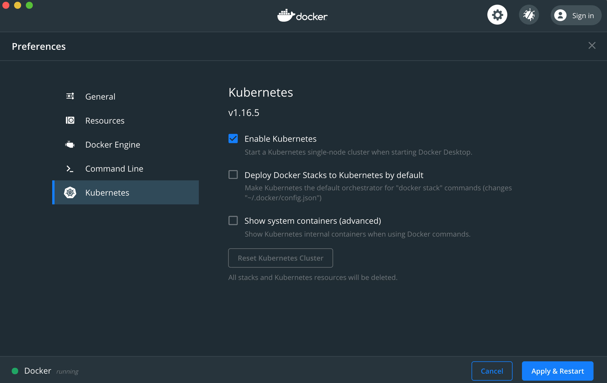

Intro to kubernetes

Setting up Kubernetes locally with Docker on macOS

1. [Install Docker](https://docs.docker.com/docker-for-mac/install/)
2. [Install kubectl](https://kubernetes.io/docs/tasks/tools/install-kubectl/#install-kubectl-on-macos) (`$ brew install kubectl`)
3. Enable Kubernetes on Docker
   
4. Set kubectl context to your local cluster
   1. `$ kubectl config get-contexts` to see all available contexts
   2. `$ kubectl config use-context docker-for-desktop`
5) Create a new namespace `kubectl create ns example`
   Optionally set this namespace as default for the kubectl context `kubectl config set-context --current --namespace=example`. Verify with `kubectl config view | grep namespace`
6) Deploy the node.js server `kubectl apply -f hapi-example-deployment.yaml -n example` // you can skip appending the namespace if you set it in the optional config set above.
7) You should now be able to see the running pod with `kubectl get pods -n example`
8) This service is now running internally inside the cluster, unexposed, which means we cannot access it.
    Optionally check this by `curl localhost:8080`
9) Let's expose the deployment with a Load Balancer `kubectl expose deployment hello-world --type=LoadBalancer --name=my-service -n example`
10) You can now get all services by running `kubectl get services -n example`
    Note the Type, External-IP and Port. We should have a Load Balancer service running on localhost with external port 8080.
11) We should now be able to `curl localhost:8080` and get a reply.

Exercise: Run a load test, `ab -n 25 -c 5 localhost:8080/` and write down the tests time to finish. Then reference the [kubectl cheat sheet](https://kubernetes.io/docs/reference/kubectl/cheatsheet/) and scale up so we have 5 running pods. Run the load test again and check if there is a difference in the tests time to finish.

Finish up by scaling down to 1 pod again.

Autoscaling:
With only 1 pod running, and our endpoint being very CPU intensive, it's time to create a `Horizontal Pod Autoscaler` that does the scaling for us.

Ahhh, sweet efficient laziness.

1. Let's apply the metrics server, `kubectl apply -f components.yaml -n example`
2. With only one pod running, lets deploy an HPA, `kubectl autoscale deployment hello-world --cpu-percent=5 --min=1 --max=10 -n example`. Verify that it's running with `kubectl get hpa -n example`
3. If you see **Targets** showing `unknown></5%>`, then please run `kubectl set resources deployment hello-world --limits=cpu=300m,memory=64Mi -n example`. It should now show a percentage and not `unknown` // not sure why this is happening
4. Run `kubectl get all -n example`, or `kubectl get pods, hpa -n example` to view the amount of running pods and hpa targets.
5. In a new terminal window, let's run the load test again to verify that autoscaling is working. `ab -n 25 -c 5 localhost:8080/`
6. In the first window, let's see the hpa in action with the commands from step 3.

Clean-up
`kubectl delete ns example` will delete everything inside the namespace, pods, services, deployments, etc
If you've set the namespace in the config, reset it with `kubectl config set-context --current --namespace=""`
Disable kubernetes again inside the Docker settings.
